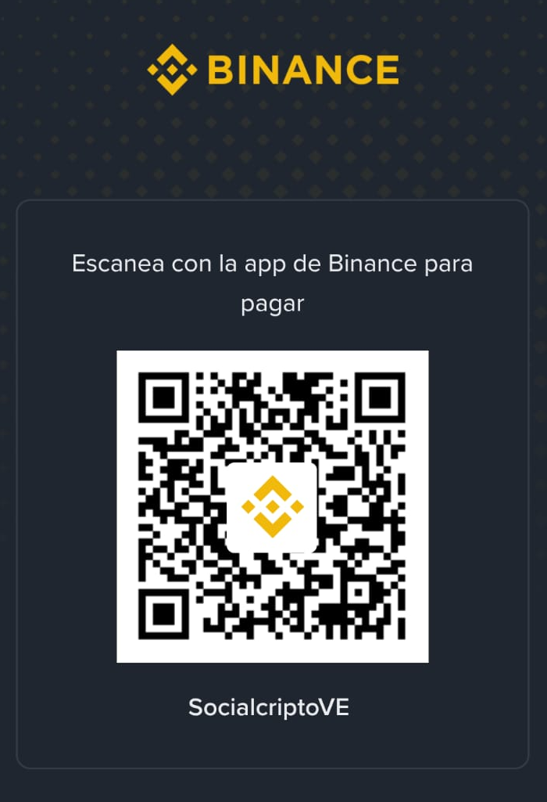

  

  

💻 Developer focused on Odoo and software development in general  
📫 Contact: angeduar95@gmail.com  +584125311197
🚀 Portfolio: https://Angeduar.github.io/Portafolio-AM

## 🧰 Technologies

---

## 🎯 Goals

- Improve my Odoo skills even more
- Increase my English level

## ☕ Buy Me a Coffee

  Support my work with USDT or crypto through Binance Pay.

  

  <b>Binance Pay ID:</b> SocialcriptoVE

